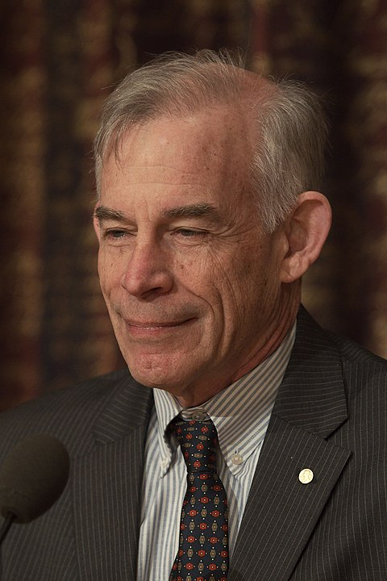
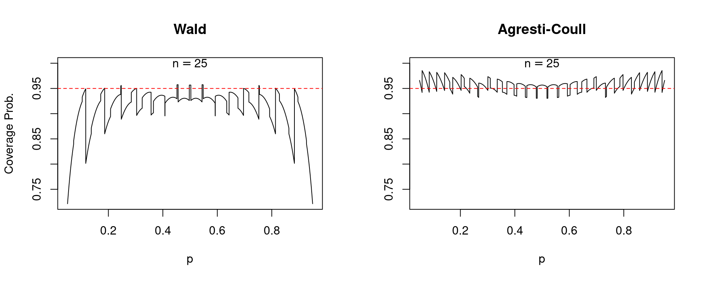
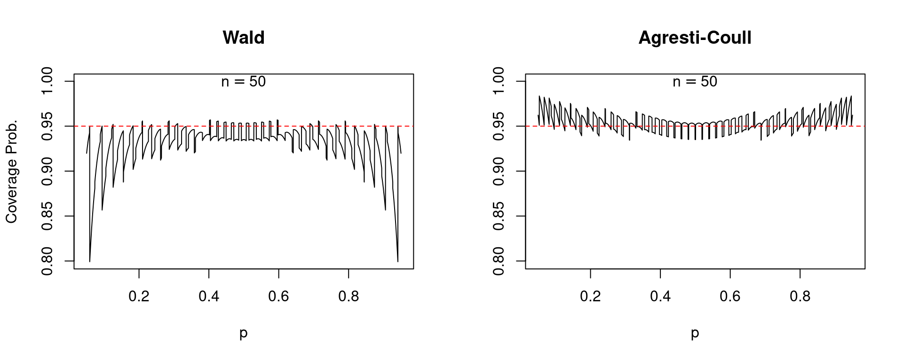
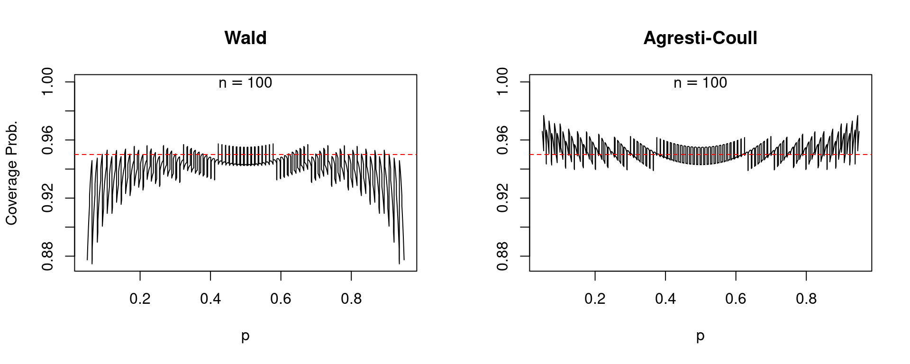
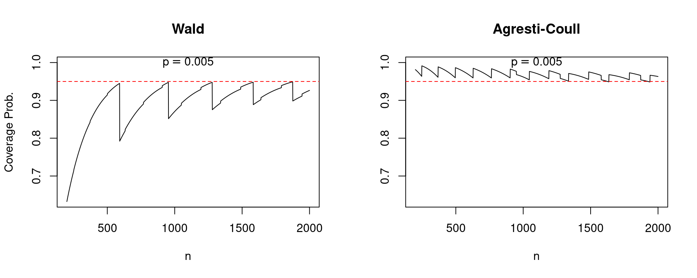

```{r global_options, include=FALSE}
rm(list=ls()) ### To clear namespace
library(knitr)
opts_chunk$set(echo=TRUE, warning=FALSE, message=FALSE)
```

---

## Goals of this Presentation^[Unless otherwise indicated, all quotes are from Sims (2010).]

1. Summarize some key points from [Sims (2010) - Understanding Non-Bayesians](http://sims.princeton.edu/yftp/UndrstndgNnBsns/GewekeBookChpter.pdf).
2. Relate them to the broader discussion of Bayesian vs.\ Frequentist inference.


---

## Fun Facts 

:::: {.columns}
::: {.column width="70%"}

\vspace{2em}

- "Understanding Non-Bayesians" was originally written for the [Handbook of Bayesian Econometrics](https://doi.org/10.1093/oxfordhb/9780199559084.001.0001) in 2010.
- Oxford University Press objected to Sims posting a pre-print on [his website](https://www.princeton.edu/~sims/).
- Sims favors open access and withdrew from the handbook in protest; the paper remains unpublished. 
- In 2011 [Sims](https://en.wikipedia.org/wiki/Christopher_A._Sims) was awarded the [Economics Nobel](https://www.nobelprize.org/prizes/economic-sciences/2011/summary/) for "understanding cause and effect in the macroeconomy."
- Take that OUP!

:::
::: {.column width="30%"}

:::

::::

---

## Motivation: Why isn't everyone Bayesian?

:::: {.columns}
::: {.column width="70%"}
> Once one becomes used to thinking about inference from a Bayesian perspective, it becomes difficult to understand why many econometricians are uncomfortable with that way of thinking. But some very good econometricians are either firmly non-Bayesian or (more commonly these days) think of Bayesian approaches as a "tool" which might sometimes be appropriate, sometimes not.

\vspace{1em}

### Some Pedantry

Maybe we should call it "Bayes-Laplace" inference: [Laplace](https://en.wikipedia.org/wiki/Pierre-Simon_Laplace#Analytic_theory_of_probabilities) developed what we would recognize as "Bayesian" inference.

:::

:::{.column width="30%"}


:::


::::

---

## What is this paper about?


- Purpose: Articulate counterarguments to Bayesian perspective
- Some counterarguments are "easily dismissed"
- Others relate to deep questions about inference in infinite-dimensional spaces

\vspace{2em}

> My conclusion is that the Bayesian perspective is indeed universally applicable, but that "non-parametric" inference is hard, in ways about which both Bayesians and non-Bayesians are sometimes careless.

\vspace{2em}

- Some of the insights in the paper are a bit scattered; I've re-arranged a bit. 
- I also don't have time to cover everything!


---

## Differing Interpretations of Probability

- Crucial background to the differences between Bayesians and Frequentists.
- Math is the same either way (Kolmogorov Axioms) but meaning is different.
- Bayesians: **"Belief-type"**  interpretation. 
- Frequentists: **"Frequency-type"**  interpretation.
- Sims doesn't discuss this. The next two slides (including quotes) are based on Chapter 11 of [An Introduction to Probability and Inductive Logic](https://www.cambridge.org/highereducation/books/an-introduction-to-probability-and-inductive-logic/EA38518337057366AD690C789DD546B8?utm_campaign=shareaholic&utm_medium=copy_link&utm_source=bookmark) by Ian Hacking.


---

## Belief-Type: "It is probable that the dinosaurs were made extinct by a giant asteroid hitting the earth."

### Interpersonal / Evidential: Keynes, Jeffreys, Jaynes 
- "Relative to the available evidence, the probability that the dinosaurs were made extinct by a giant asteroid hitting the earth is high--about 0.9."
- "She thinks that [the statement] is *interpersonal*--because it is about what is reasonable for any reasonable person to believe. And since the degree of belief should depend on the available *evidence* we call this *interpersonal/evidential*."

### Personal Degree of Belief: de Finetti, Savage
- "I personally am very confident that the dinosaurs were made extinct by a giant asteroid hitting earth."
- "If I had to make a bet on it, I would bet 9 to 1 that the dinosaurs were made extinct by a giant asteroid hitting the earth."


---

## Frequency-Type: "The probability of getting heads with this coin is 0.6." 

> The truth of this statement seems to have nothing to do with what be believe. We seem to be making a completely factual statement about a material object, namely the coin ... We may be saying something like:
>
>   - In repeated tossing, the *relative frequency* of heads settles down to a stable proportion, 6/10.
>   - The coin has a *tendency* to come down heads far more often than tails.
>   - It has a *propensity* or *disposition* to favor heads.
>   - Or we are saying something more basic about the asymmetry of the coin and the tossing device. We may be referring to the *geometry* and *physics* of the coin, which cause it to come down more often heads than tails.


---

## Learn some \$*@%\&!\# physics before you talk to me about coin flips!^[See Chapter of 10 of Jaynes' [Probability Theory: The Logic of Science](https://bayes.wustl.edu/etj/prob/book.pdf) for more discussion.]

\vspace{1em}

> During its flight the angular momentum of the coin maintains a fixed direction in space (but the angular *velocity* does not; and so the tumbling may appear chaotic to the naked eye). Let us denote this fixed direction by the unit vector $n$; it can be any direction you choose, and **it is determined by the particular kind of twist you give the coin at the instance of launching. Whether the coin is biased or not, it will show exactly the same fact throught the motion if viewed from this direction.**

\vspace{1em}

> Denote by $k$ a unit vector passing through the coin along its axis, with its point on the 'heads' side. Now toss the coin with a twist so that $k$ and $n$ make an acute angle, then catch it with your palm held flat, in a plane normal to $n$. On successive tosses, you can let the angle between $n$ and $k$ vary widely; the tumbling motion will then appear entirely different to the eye on different tosses, and yet it would require almost superhuman powers of observation to discover your strategy.


---

## Bayesian versus Frequentist Approaches

### Frequentist 
- "Insists on a sharp distinction between unobserved, but non-random 'parameters' and observable, random data."
- "Works entirely with the probability distributions of data, conditional on unknown parameters--estimators and test statistics, for example--and makes assertions about the distribution of those function of the data, conditional on parameters"

### Bayesian 
- "Treats everything as random before it is observed, and everything observed as, once observed, no longer random." 
- "Aims at assisting in constructing probability statements about anything as yet unobserved (including 'parameters') conditional on the observed data."

---

## Let's unpack this a bit: Frequentists 

- Condition on parameters; make probability statements that average over different *datasets* you could potentially observe.
- E.g. $X_1 ..., X_{100}$ is a random sample from a $\text{N}(\mu, \sigma^2)$ population with $\sigma=1$ known.
- "$\bar{X}_n \pm 1.96 \times \sigma/\sqrt{n}$ is a 95\% confidence interval for $\mu$." 
- Translation: In 95\% of the datasets we could possibly observe, the sample mean will land within about $\pm 0.2$ of the true (fixed and unknown) value of $\mu$.
- The observed interval $\bar{x} \pm 0.2$ either contains $\mu$ or doesn't: nothing is random after we have observed the data. 
- Traditional (Neyman-Pearson) inference is *pre-experimental*: inductive behavior rather than inductive inference.

---

## Let's unpack this a bit: Bayesians

- Condition on *observed data*; make probability statements that average over different *parameter values* that could potentially have generated the data.
- E.g. $X_1 ..., X_{100}$ is a random sample from a $\text{N}(\mu, \sigma^2)$ population with $\sigma=1$ known.
- Need a prior: just for simplicity choose a "vague" one e.g. $\mu \sim \text{N}(0, 10000)$
- "The posterior distribution of $\mu$ is (approximately) $\text{N}(\bar{x}, 1/100)$, so the 95\% highest posterior density interval (HPDI) for $\mu$ is approximately $\bar{x} \pm 0.2$." 
- Translation: Given the observed data, there is around a 95\% probability that the population mean $\mu$ lies within $\pm 0.2$ of the sample mean $\bar{x}$.
- The observed sample mean $\bar{x}$ is fixed and known; the population mean $\mu$ is unknown and treated as random.
- Bayesian inference is *post-experimental* (conditional): inductive inference under an assumed model given observed information.

---


## Implications for Decision-Making

> Bayesian inference therefore feeds naturally into discussion of decisions that must be made under uncertainty, while frequentist analysis does not. There are theorems showing that under certtain assumptions is is optimal to make decisions based on probability distributions over unknown quantities, but it is probabily more important that most actual decision makers find the language of probability a natural way to discuss under uncertainty and how the results of data analysis may be relevant to their decisions.

---

## Why does Sims put the word "parameters" in quotes?^[See Chapters 1 and 5 of Poirier (1996) *Intermediate Statistics and Econometrics*]

> Bayesians take models seriously not literally; Frequentists take models literally not seriously.

- "Realism" versus "Instrumentalism": are parameters "real" or merely convenient mathematical fictions that we use to make predictions about observable quantities?
- There is a spectrum but Bayesians tend more towards instrumentalism and Frequentists towards realism.
- Testing point null hypothesis or we are using the "true model" is a realist enterprise.
- de Finetti's representation theorem: infinitely exchangeable sequence of RVs can be represented as a sequence of conditionally indep.\ RVs given a random parameter. 
- Exactly "likelihood" vs "prior" distinction from Bayesian inference; arises purely as a way of describing distribution of observed data.


---

## "Easily Dismissed" Objection \# 1: "Bayseian Inference is Subjective" 

> Bayesian inference makes the role of subjective prior beliefs in decision-making explicit, and describes clearly how such beliefs should be modified in the light of observations. But most scientific work with data least to publication, not directly to decision-making. That is, most data analysis is aimed at an audience who face different decision problems and may have diverse prior beliefs. In this situation ... useful data analysis summarizes the shape of the likelihood. Sometimes it is helpful to apply non-flat, simple, standardized prior in reporting likelihood shape, but **these are chosen not to reflect the investigator's personal beliefs, but to make the likelihood description more useful to a diverse audience**. A Bayesian perspective makes the entire shape of the likelihood in any sample directly interpretable, whereas a frequentist perspective has to focus on the large-sample behavior of the likelihood near its peak.


---

## "Easily Dismissed" Objection \# 1: "Bayseian Inference is Subjective" 

> Though frequentist data analysis makes no explicit use of prior information, **good applied work does use prior beliefs informally even if it is not explicitly Bayesian**. Models are experimented with, and versions that allow reasonable interpretations of the estimated parameter values are favored. Lag lengths in dynamic models are experimented with, and shorter lag lengths are favored if longer ones add little explanatory power. These are reasonable ways to behave, but they are not "objective".


---

## "Easily Dismissed" Objection \#1: "Bayesian Inference is Subjective" 

> Researchers who take a Bayesian perspective can take a completely "objective" approach, by aiming at description of the likelihood. Frequentists have no formal interpretation of the global likelihood shape. Frequentist textbook descriptions of methods make no reference to subjective prior beliefs, but everyone recognizes that good applied statistical practice, even for frequentists, entails informal use of prior beliefs when an actual decision is involved. Its supposed "subjectivity" is therefore no reason to forswear the Bayesian approach to inference.


## Some Other Views on "Subjectivity"

### Gelman et al (2014) - *Bayesian Data Analysis*
\vspace{0.5em}
> Bayesian methods are sometimes said to be especially subjective because of their reliance on a prior distribution, but in most problems, scientific judgement is necessary to specify both the "likelihood" and "prior" parts of the model. For example, linear regression models are generally at least as suspect as any prior distribution that might be assumed about the regression parameters.

### McElreath (2020) - *Statistical Rethinking*
\vspace{0.5em}

> Within Bayesian data analysis in the natural and social sciences, the prior is considered to be just part of the model. As such it should be chosen, evaluated, and revised just like all the other components of the model ... priors and Bayesian data analysis are no more inherently subjective thatn likelihoods and the repeated sampling assumptions required for significance testing. 

<!--
### Johnson, Ott & Dogucu (2022) - Bayes Rules! Intro to Applied Bayesian Modeling
\vspace{0.5em}

> Frequentist methods were embraced as the superior *objective* alternative to the *subjective* Bayesian philosophy. This subjective stigma is slowly fading for several reasons. First, the "subjective" label can be stamped on *all* statistical analyses, whether frequentist or Bayesian. Our prior knowledge naturally informs what we measure, why we measure it, and how we model it. Second, post-Enlightenment, "subjective" is no longer such a dirty word.
-->

---

## Fighting Words... 


### Jaynes (2003) - *Probability Theory: The Logic of Science*
\vspace{0.5em}

> Today one wonders how it is possible that orthodox logic continues to be taught in some places year after year and praised as "objective", while Bayesians are charged with "subjectivity". Orthodoxians, preoccupied with fantasies about nonexistent data sets and, in principle, unobservable limiting frequencies – while ignoring relevant prior information – are in no position to charge anybody with "subjectivity". If there is no sufficient statistic, the orthodox accuracy claim based on a single "statistic" simply ignores not only the prior information, but also all the evidence in the data that is relevant to that accuracy: hardly an "objective" procedure. If there are ancillary statistics and the orthodoxian follows Fisher by conditioning on them, he obtains just the estimate that Bayes' theorem based on a noninformative prior would have given him by a shorter calculation. Bayes' theorem would have given also a defensible accuracy claim.


---

## Easily Dismissed Objection \#2: "Bayesian Inference is Harder"

- Frequentist inference is often (wrongly) conflated with "convenient and intuitively appealing estimators" asymptotic approximations. 
- Could instead aim for exact finite-sample distribution theory and fully efficient estimators but this is often intractable.
- "Easier to characterize optimal small-sample inference from a Bayesian perspective, and much of the Bayesian literature has insisted that this is a special advantage."
- Simulation-based methods make it easy to explore the shape of complicated likelihood functions in large, non-linear models.

---

## Side Note on Modern Simulation-based Methods 

- Probabilistic programming languages (PPLs) like STAN, JAGS, BUGS, PyMC3 make it extremely easy to build and estimate complex Bayesian models.
- We'll have a session on this in September with special guest [Alex Andorra](https://github.com/AlexAndorra).
- [StanCon 2024](https://mc-stan.org/events/stancon2024/) is in Oxford this year! (September 9-13th, 2024) 

---


## From Chapter 1 of *Asymptotic Statistics* by van der Vaart 

> For a relatively small number of statistical problems there exists and exact, optimal solution ... If exact optimality theory does not give results, be it because the problem is intractable or because there exist no "optimal" procedures, then asymptotic optimality theory may help ... **strictly speaking, most asymptotic results that are currently available are logically useless. This is because most asymptotic results are limit results, rather than approximations consisting of an approximating formula plus an accurate error bound** ... This is why there is good asymptotics and bad asymptotics and why two types of asymptotics sometimes lead to conflicting claims ... Because it may be theoretically very hard to ascertain that approximation errors are small, one often takes recourse to simulation studies 

---

## But what about GMM, OLS and IV?! 

- "There is no reason in principle that very easily implemented estimators like [these] ... have to be interpreted from a Frequentist perspective."
- Kwan (1998) if $\sqrt{n} (\hat{\beta} - \beta) \to_d \text{Normal}(0, \Sigma)$ then, under regularly conditions and for large $n$, we can approximate $\beta|\widehat{\beta} \approx \text{Normal}(\widehat{\beta}, \Sigma/n)$.
- When the regularity conditions hold, can interpret Frequentist confidence intervals as (approximate) Bayesian posterior credible intervals.
- Only conditions on $\widehat{\beta}$, not the full data: "throws information away."

---

## Stronger Result

> If we have a trustworthy model for which the likelihood function can be computed, the likelihood function will, under regularity conditions, take on a Gaussian shape in large samples, with the mean at the maximum likelihood estimate (MLE) and the covariance matrix given by the usual frequentist estimator for the covariance matrix of an MLE.

### Differences from Kwan (1998) Result

1. For large $n$, conditioning on MLE and using a large-sample normal approximation doesn't throw away information: as good as conditioning on all the data.
2. Only a shortcut: from a Bayesian perspective, can always check the quality of the approximation by examining the whole likelihood function.
3. Lacks "robustness" in that: "interpreting the likelihood shape as the posterior generally requires believing that the likelihood is correctly specified." 

---

## "Pragmatic Bayesian" Approach

> In some circumstances we need to be able to reach conclusions conditional on standard, easily computed statistics, even when they are not sufficient statistics, and that sometimes approximate distribution theory, justified by the fact that in large samples with high probability the approximation is good, is the best that can be done with the available time and reources. Yet at the same time, it is always worthwhile to consider whether such compromises are throwing away a great deal of information or resulting in seriously distorted posterior distributions.

---

## What does it mean to be "conservative"? 

> These models are conservative in a sense -- they promise no more precise estimates, asymptotically, that what can be obtained under the "weakest" of the models defined by the assumptions supporting the frequentist asymptotics. But to say they are conservative may be misleading. Using a model that fails to make efficient use of the data can lead to large, avoidable losses. Concluding that the data do not support a finding that a drug or social policy intervention has important effects is a costly error if the conclusions is incorrect, and reading such a conclusion in a naive attempt to be "robust" by using "weak assumptions" is not in any real sense conservative.

---

## Generating Conservative Models^[Chapter 10 of *Statistical Rethinking* by McElreath explains this better than Sims (2010).]

- Caveats notwithstanding, it might be convenient to set up a "conservative" Bayesian model. How could we do it?
- Suppose we have "weak assumptions" of the form $\mathbb{E}[g(y,\beta)|\beta)] = 0$. What likelihood $f(y|\beta)$ satisfies this but is as "uninformative as possible". 
- Formally: "minimize Shannon mutual information between $y$ and $\beta$" 
- Solution: exponential family models! 
- E.g.\ linear regression with normal errors for $\mathbb{E}\left[(y - \mathbf{x}'\boldsymbol{\beta}) \mathbf{x}|\boldsymbol{\beta}\right] = \mathbf{0}$
- "Models generated in this way are conservative *only* for inference about $\beta$ ... [they] are generally dogmatic about other aspects of the distribution" of $y$.


---


## Less Easily Dismissed Objection \#1: Handy Methods Seem Un-Bayesian

- To me this doesn't really seem like an "objection" -- more of a continuation of the "Pragmatic Bayesian" discussion from above.
- Above: IV, GMM etc.\ can be given "limited information" Bayesian interpretation.
- Frequentist asymptotic distribution can be viewed as an approximate Bayesian posterior under "essentially the same weak assumptions"
- I.e. don't assume known likelihood: only moment/regularity conditions 
- "But every application of asymptotic approximate theory relying on 'weak assumptions' involves a Bayesian judgment call."
- In other words: when does the Frequentist asymptotic distribution theory perform well *on its own terms*?
- To rely on the Central Limit Theorem in practice, for example, is to implicitly assume we're in a region of the parameter space where it works well.


---


## An even simpler example than the one from Sims (2010)...

- Suppose that $X_1, ..., X_n \sim \text{iid Bernoulli}(p)$ where $p$ is unknown.
- Let $\widehat{p}$ be the sample proportion, i.e.\  $\frac{1}{n} \sum_{i=1}^n X_i$
- The Central Limit Theorem (CLT) gives $\widehat{p} \approx \text{Normal}(p, \widehat{p}(1-\widehat{p})/n)$ for large $n$.
- Approximate "Limited Information" Posterior: $p \approx \text{Normal}(\widehat{p}, \widehat{p}(1-\widehat{p})/n)$.) 
- 95\% Confidence / Credible Interval: $\widehat{p} \pm 1.96 \times \sqrt{\widehat{p}(1 - \widehat{p})/n}$

\vspace{1em}

### But this approximation is *terrible* when $p$ is far from $0.5$...
- Bayesian Perspective: bad conditional properties e.g.\ empty intervals!
- Frequentist Perspective: coverage probabilities are all over the place!
- "Textbook" rule of thumb $np(1-p) > 5$ is a Bayesian judgement call (also false!)


---

{width=83%}
\vspace{-1.3em}

{width=83%}


---

{width=83%}
\vspace{-1.3em}

{width=83%}


---

## Challenges of Non-parametrics 

- Claims that Bayesian inference "breaks down" in high-dimensional problems: "posterior inconsistency" 
- Sims argues that this problem isn't unique to Bayes: frequentists encounter what amounts to the same problem, but it's "hidden away" in "smoothness assumptions" 
- High-dimensional problems are just hard! Be careful about prior specification.


---


## Chamberlain \& Imbens (1996)

\[
Y = \alpha + \beta S + U, \quad S = Z'\gamma + V
\]

\vspace{1em}

> In this paper, we suggest how Bayesian inference might proceed in models with many instruments that are potentially weakly correlated with the endogenous regressor ... We apply this model to an example that has motivated much of the theoretical work in this area, the Angrist and Krueger (1991) ...  analysis of returns to schooling using quarter of birth to form instrumental variables. 

\vspace{1em}

> The conventional choice for a "diffuse" prior distribution [for $\gamma$] is in fact very informative ... [it] dogmatically asserts that the instrumental variables are *collectively* very powerful predictors of $S$.

- Frequentist solution (TSLS) is similar to the "flat prior" Bayesian approach.
- Useful dialogue: what prior does the frequentist solution correspond to? Frequency properties of Bayes? 

<!--

---

## Example 1: The Wasserman Problem

* Setup: Observing $(\xi, R, Y)$ with unobserved $\theta$ 
* Goal: Estimate $\psi = \mathbb{E}[\theta]$
* Bayesian approaches:
  1. Independence case
  2. Dependence case (sieve method)
  3. Limited information approach

---

## Critique of Wasserman's Conclusions

I probably still want to mention these points, but I don't really want to get into the Wasserman example since it won't be as familiar to the audience.

* Bayesian methods are not necessarily insensitive to data
* Importance of appropriate prior specification
* Pitfalls of high-dimensional parameter spaces

---

-->

<!--
## Example 2: Robust Variance Estimates in Regression


* OLS with sandwich covariance matrix
* Efficiency bounds (Chamberlain, 1987): "sandwich estimator provides the efficiency bound
* When is OLS with sandwich appropriate?
  - Large samples
  - Likely nonlinear regression function
  - Interest in best linear predictor


---

## Conclusion

* Bayesian perspective is universally applicable
* Importance of careful modeling in high-dimensional spaces
* Pragmatic Bayesian approach:
  - Recognize limitations of asymptotic approximations
  - Consider model improvements when appropriate
  - Use OLS with sandwich standard errors judiciously

-->