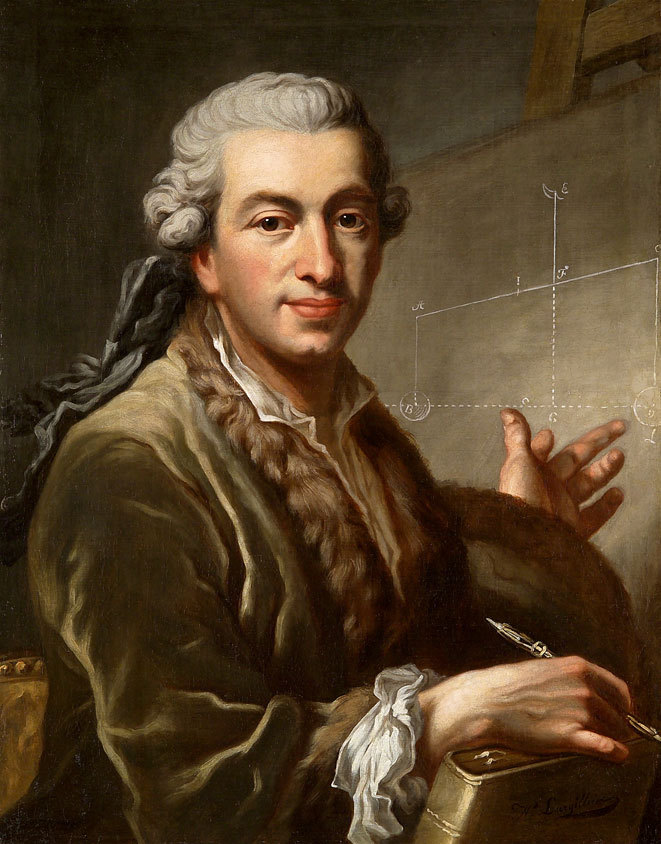

```{r global_options, include=FALSE}
rm(list=ls()) ### To clear namespace
library(knitr)
opts_chunk$set(echo=TRUE, warning=FALSE, message=FALSE)
```

---

## Goals of this Presentation 

1. Summarize the main points of [Sims (2010) - Understanding Non-Bayesians](http://sims.princeton.edu/yftp/UndrstndgNnBsns/GewekeBookChpter.pdf)
2. Relate them to the broader discussion of Bayesian vs.\ Frequentist inference.

\vspace{1em}

\alert{I'll put my own commentary and that of others in RED to make it clear when I am not paraphrasing Sims (2010).}

---

## Fun Facts 

:::: {.columns}
::: {.column width="70%"}
- "Understanding Non-Bayesians" was originally written for the [Handbook of Bayesian Econometrics](https://doi.org/10.1093/oxfordhb/9780199559084.001.0001) in 2010.
- Oxford University Press objected to Sims posting a pre-print on [his website](https://www.princeton.edu/~sims/).
- Sims support open access research and withdrew from the handbook in protest; the paper remains unpublished. 
- In 2011 [Chris Sims](https://en.wikipedia.org/wiki/Christopher_A._Sims) was awarded the [Nobel Prize in Economics](https://www.nobelprize.org/prizes/economic-sciences/2011/summary/) with Tom Sargent for "understanding cause and effect in the macroeconomy."
- Take that OUP!

:::
::: {.column width="30%"}

:::

::::

---

## Motivation: Why isn't everyone Bayesian?

:::: {.columns}
::: {.column width="70%"}
> Once one becomes used to thinking about inference from a Bayesian perspective, it becomes difficult to understand why many econometricians are uncomfortable with that way of thinking. But some very good econometricians are either firmly non-Bayesian or (more commonly these days) think of Bayesian approaches as a "tool" which might sometimes be appropriate, sometimes not.

:::

:::{.column width="30%"}



:::

::::

\alert{If we gave credit where credit is really due, we should be calling it "Laplacian Inference" since it was}
[Laplace](https://en.wikipedia.org/wiki/Pierre-Simon_Laplace#Analytic_theory_of_probabilities) \alert{who first articulated what we would recognize as Bayesian inference.}

---

## Introduction

* Difficulty in understanding non-Bayesian perspectives
* Purpose: Articulate counterarguments to Bayesian perspective
* Some counterarguments are easily dismissed
* Others relate to deep questions about inference in infinite-dimensional spaces

---

## Bayesian vs. Frequentist Approaches

### Frequentist Approach:
* Sharp distinction between parameters and data
* Works with probability distributions of data, conditional on parameters

### Bayesian Approach:
* Treats everything as random before observation
* Aims to construct probability statements about unobserved quantities

---

## Implications for Decision-Making

* Bayesian inference feeds naturally into decision-making under uncertainty
* Frequentist analysis does not directly provide probabilities for decision-makers

---

## Easily Dismissed Objections

1. **"Bayesian inference is subjective"**
   - Bayesians can take an "objective" approach by describing the likelihood
   - Good frequentist practice also involves informal use of prior beliefs

2. **"Bayesian inference is harder"**
   - Often easier to characterize optimal small-sample inference from Bayesian perspective
   - Frequentist asymptotic results can often be given Bayesian interpretations

---

## Less Easily Dismissed Objections

### Handy methods that seem un-Bayesian
* IV, GMM, sandwich estimators, kernel methods
* Can be given limited information Bayesian interpretations
* Involve implicit Bayesian judgments in asymptotic theory

---

## Challenges in Non-parametrics

* Infinite-dimensional parameter spaces
* Consistency issues in Bayesian inference
* Pitfalls in high-dimensional spaces:
  - Priors can be unintentionally dogmatic
  - Importance of careful prior specification

---

## Example 1: The Wasserman Problem

* Setup: Observing $(\xi, R, Y)$ with unobserved $\theta$ 
* Goal: Estimate $\psi = \mathbb{E}[\theta]$
* Bayesian approaches:
  1. Independence case
  2. Dependence case (sieve method)
  3. Limited information approach

---

## Critique of Wasserman's Conclusions

* Bayesian methods are not necessarily insensitive to data
* Importance of appropriate prior specification
* Pitfalls of high-dimensional parameter spaces

---

## Example 2: Robust Variance Estimates in Regression

* OLS with sandwich covariance matrix
* Efficiency bounds (Chamberlain, 1987)
* When is OLS with sandwich appropriate?
  - Large samples
  - Likely nonlinear regression function
  - Interest in best linear predictor

---

## Conclusion

* Bayesian perspective is universally applicable
* Importance of careful modeling in high-dimensional spaces
* Pragmatic Bayesian approach:
  - Recognize limitations of asymptotic approximations
  - Consider model improvements when appropriate
  - Use OLS with sandwich judiciously

---

## Questions?

